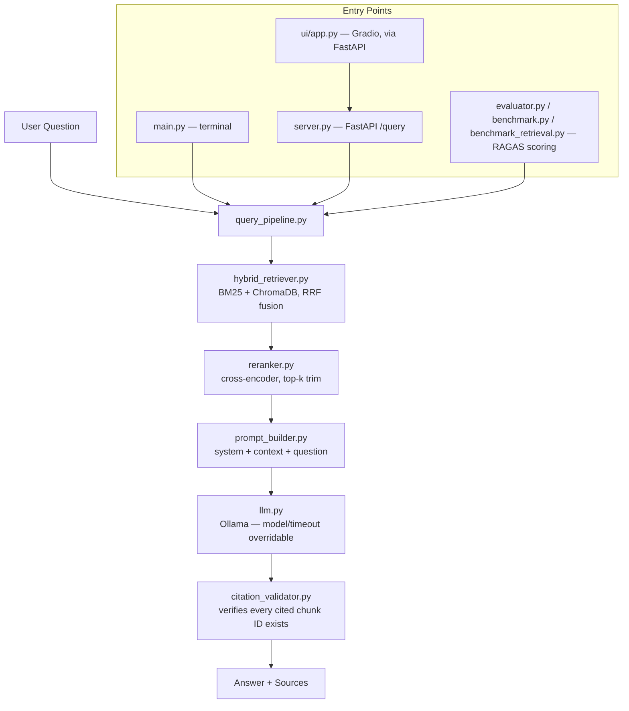

# local-ai-stack

**A six-phase production AI system built entirely on open-source models running locally on Apple Silicon. No cloud APIs. No managed services. Every architectural decision documented.**

> Phase 2 of 6 — In Progress (Day 15/15, close-out gate pending — see Roadmap)

---

## What This Is

This repository is a single evolving codebase that grows from a terminal-based document Q&A tool into a production-grade AI system with hybrid retrieval, citation enforcement, a CI quality gate, full observability, fine-tuned models, and a real-time voice interface.

Each phase extends the previous one. Nothing gets thrown away.

---

## What It Does (Phase 2 — current)

- Ingests 8 file formats: `.txt`, `.md`, `.pdf`, `.docx`, `.pptx`, `.xlsx`, `.csv`, `.html`
- Hybrid retrieval: BM25 keyword search + ChromaDB semantic vector search, fused with Reciprocal Rank Fusion — retrieval mode is switchable per call (`hybrid` / `bm25_only`) for A/B evaluation
- Cross-encoder reranking on every query
- Citation enforcement — every claim traces back to a source chunk ID, validated before the response is returned
- FastAPI backend (`/health`, `/query`, `/index`) + Gradio web interface
- RAGAS evaluation harness (faithfulness, answer relevancy, context precision, context recall)
- GitHub Actions CI gate — blocks merges to `main` if faithfulness drops below 0.75
- Structured JSON logging with per-stage latency and token counts
- Benchmark scripts: generation-model comparison (`benchmark.py`) and retrieval-strategy comparison (`benchmark_retrieval.py`)

## Architecture



---

## Project Structure

```
local-ai-stack/
├── docs/                                # Source documents (all 8 formats)
├── src/
│   ├── ingestion/
│   │   ├── loader.py
│   │   ├── extractors/                  # text, pdf, docx, pptx, xlsx, csv, html
│   │   ├── chunker.py
│   │   ├── embedder.py
│   │   └── index_documents.py
│   ├── retrieval/
│   │   ├── vector_store.py
│   │   ├── bm25_index.py
│   │   ├── hybrid_retriever.py
│   │   └── reranker.py
│   ├── generation/
│   │   ├── prompt_builder.py
│   │   ├── llm.py
│   │   ├── citation_validator.py
│   │   └── query_pipeline.py
│   ├── api/
│   │   ├── server.py
│   │   └── schemas.py
│   ├── evaluation/
│   │   ├── eval_set.json
│   │   ├── evaluator.py
│   │   ├── benchmark.py
│   │   └── benchmark_retrieval.py
│   └── main.py                          # Terminal Q&A loop
├── ui/
│   └── app.py                           # Gradio web interface
├── .github/workflows/eval_gate.yml      # CI: fail if faithfulness < 0.75
├── chroma_db/                           # Auto-created, gitignored
├── logs/                                # Auto-created, gitignored
├── tests/                               # pytest suite
│   ├── test_chunker.py
│   ├── test_citation_validator.py
│   └── test_hybrid_retriever.py
├── setup.sh                             # One-command environment setup
├── .env
├── .gitignore
├── requirements.txt
└── README.md
```

---

## Stack

| Component | Tool | Notes |
|-----------|------|-------|
| Language | Python 3.12 | via pyenv |
| Model runtime | Ollama | Local inference — no cloud |
| Primary model | Gemma 4 26B | `gemma4:26b` |
| Embedding model | nomic-embed-text | via Ollama |
| Vector store | ChromaDB | Persistent, local |
| Keyword search | BM25 (rank-bm25) | Fused with vector search via RRF |
| Reranker | cross-encoder/ms-marco-MiniLM-L6-v2 | sentence-transformers |
| API | FastAPI + Uvicorn | `/health`, `/query`, `/index` |
| Web UI | Gradio | Talks to FastAPI over HTTP |
| Evaluation | RAGAS | Faithfulness, relevancy, precision, recall |
| CI/CD | GitHub Actions | Self-hosted runner (DEC-022) |
| Logging | Loguru (custom flat sink) | Structured JSON, per-stage latency |
| Config | python-dotenv | `.env` file management |

---

## Hardware

Apple M1 Max · 64 GB Unified Memory · macOS

All models run locally. Metal GPU acceleration via Ollama — no configuration needed. Gemma 4 26B runs at ~20–35 tokens/sec on this hardware. See `benchmark_results.json` for real numbers across model sizes (Ministral 3B, Gemma 4 26B — Llama 3.3 70B excluded due to memory pressure and since removed from local disk to reclaim space, see DEC-028 and DEC-031).

---

## Setup

**One-command setup** (after installing [Ollama](https://ollama.com/download) and Python 3.12 via pyenv):

```bash
git clone https://github.com/SavyOnAI/local-ai-stack.git
cd local-ai-stack
chmod +x setup.sh
./setup.sh
```

This pulls both models, creates the virtual environment, installs dependencies, and indexes any documents already in `docs/`. Add your own files to `docs/` first if you want them indexed automatically.

**Manual steps** (if you'd rather run each stage yourself, or `setup.sh` doesn't fit your environment):

```bash
# 1. Clone the repo
git clone https://github.com/SavyOnAI/local-ai-stack.git
cd local-ai-stack

# 2. Pull the models
ollama pull gemma4:26b
ollama pull nomic-embed-text

# 3. Create and activate virtual environment
python -m venv local-ai-stack-venv
source local-ai-stack-venv/bin/activate

# 4. Install dependencies
pip install -r requirements.txt

# 5. Add your documents to docs/
# (all 8 formats supported: .txt .md .pdf .docx .pptx .xlsx .csv .html)

# 6. Index your documents
python -m src.ingestion.index_documents

# 7a. Run the terminal interface
python -m src.main

# 7b. Or run the API + web UI (two terminals)
uvicorn src.api.server:app --reload
python ui/app.py
```

---

## Configuration

All config lives in `.env` — never hardcoded.

| Variable | Default | Description |
|----------|---------|-------------|
| `MODEL_NAME` | `gemma4:26b` | Ollama model string |
| `OLLAMA_URL` | `http://localhost:11434/api/generate` | Ollama API endpoint |
| `CHUNK_SIZE` | `800` | Characters per chunk |
| `CHUNK_OVERLAP` | `150` | Characters repeated between chunks |
| `DOCS_DIR` | `docs` | Folder containing source documents |
| `TOP_K` | `5` | Number of chunks passed to the LLM per query |

**Chunking defaults note:** 800/150 have never been benchmarked against an alternate configuration on the real eval set — the current numbers confirm DEC-024's context_precision diagnosis (narrow questions vs. large documents) but don't test whether a different chunk size/overlap would help. Deferred to Phase 3/4.

---

## Example

```
=== local-ai-stack — RAG Pipeline ===
Type your question and press Enter. Type 'quit' to exit.
Loading indexes...
Ready.
You: What does the OpenAI agents guide say about guardrails?
Answer: According to OpenAI_a_practical_guide_to_building_agents.pdf
[chunk_47], guardrails are the mechanisms that keep agent behavior within
defined bounds — including input validation, output filtering, and
escalation to human review when confidence is low.
```

---

## Known Limitations (Current — Phase 2)

- **Hybrid retrieval vs. BM25-only is a mixed result on this eval set, not a clean win.** A direct comparison (`benchmark_retrieval.py`, full n=30 run) showed hybrid *losing* on context_precision (0.4301 vs. 0.4421) and *winning* on context_recall (0.8000 vs. 0.7333). The recall gap (+0.067) is over 5x the precision gap (-0.012) — hybrid appears to trade a small precision cost for a meaningfully broader, more complete retrieval. The Phase 2 PRD §12 criterion "hybrid retrieval outperforms keyword-only" is therefore **not confirmed as a uniform win** — it's confirmed as a recall improvement with a small precision tradeoff. Hybrid retrieval remains architecturally justified independent of this result (BM25 and vector search fail on different query types — see DEC-006). Full writeup in DEC-031.
- context_precision capped around 0.43–0.47 in both retrieval modes — fixed `top_k=5` retrieves more chunks than a narrow question needs (DEC-024). CI-warning-level only, not build-blocking.
- OCR for scanned/image-only PDFs not implemented — pypdf/pdfplumber skip image-only pages (deferred to Phase 3+)
- Slide images and flowchart relationships in PPTX not extracted — text only (deferred to Phase 3+)
- Llama 3.3 70B excluded from benchmarking — memory pressure on 64GB during RAGAS scoring (DEC-028); three-model benchmark formally scoped down to two models (DEC-031)
- Self-hosted CI runner only runs when the Mac is on (DEC-022) — acceptable for a solo project
- `setup.sh` has not yet been verified end-to-end on a clean machine — test before relying on it

---

## Testing

pytest coverage as of Day 14: `chunker.py`, `citation_validator.py`, `hybrid_retriever.py`.
Not yet covered: `bm25_index.py`, `vector_store.py`, `reranker.py`, `query_pipeline.py`, `server.py` (API integration tests — deferred to Phase 4, see DECISIONS.md Decisions Pending)

Run with:

```bash
python -m pytest tests/ -v
```

---

## Roadmap

| Phase | Name | Status |
|-------|------|--------|
| 1 | Local RAG Pipeline | ✅ Complete |
| 2 | Production RAG Application | 🔄 In Progress — Day 15, §12 success-criteria gate check pending |
| 3 | Local SLM Benchmarking | ⬜ Planned |
| 4 | Monitoring & Observability | ⬜ Planned |
| 5 | Fine-Tuning with LoRA & DPO | ⬜ Planned |
| 6 | Real-Time Multimodal Application | ⬜ Planned |

---

## Architectural Decisions

Every significant decision — tool selection, model choice, retrieval strategy — is documented with alternatives considered and reasons chosen in [`DECISIONS.md`](DECISIONS.md).

---

## Function Reference

A quick index of every function in the codebase. Updated as new files are added.

### src/ingestion/
| File | Function | Purpose |
|---|---|---|
| `loader.py` | `find_documents(docs_dir)` | Walk directory, return list of supported file paths |
| `loader.py` | `load_document(file_path)` | Route a single file to its extractor, return text |
| `loader.py` | `load_all_documents(docs_dir)` | Find and extract all documents, return dict of path → text |
| `chunker.py` | `chunk_text(text, chunk_size, overlap)` | Split text into overlapping chunks, return list of strings |
| `chunker.py` | `chunk_document(file_path, text, chunk_size, overlap)` | Chunk text and attach source metadata, return list of dicts |
| `embedder.py` | `embed_text(text, mode)` | Generate embedding vector via nomic-embed-text. mode: "document" or "query" |
| `index_documents.py` | `index_documents(docs_dir, chunk_size, overlap)` | Run full ingestion pipeline: extract → chunk → embed → store |

### src/ingestion/extractors/
| File | Function | Purpose |
|---|---|---|
| `text_extractor.py` | `extract(file_path)` | Extract text from .txt and .md files |
| `pdf_extractor.py` | `extract(file_path)` | Extract text from .pdf files page by page, with 3-tier corruption fallback (DEC-023) |
| `docx_extractor.py` | `extract(file_path)` | Extract paragraphs and table cells from .docx files |
| `pptx_extractor.py` | `extract(file_path)` | Extract title, body, and notes per slide from .pptx files |
| `csv_extractor.py` | `extract(file_path)` | Convert CSV rows to natural language sentences using header labels |
| `xlsx_extractor.py` | `extract(file_path)` | Convert Excel rows to sentences across all sheets using header labels |
| `html_extractor.py` | `extract(file_path)` | Strip HTML tags and return clean readable text |

### src/retrieval/
| File | Function | Purpose |
|---|---|---|
| `vector_store.py` | `get_collection(persist_dir, collection_name)` | Connect to or create a ChromaDB collection |
| `vector_store.py` | `add_chunks(collection, chunks)` | Store chunks with embeddings and metadata in ChromaDB (DEC-019) |
| `vector_store.py` | `query_collection(collection, query_vector, n_results)` | Search ChromaDB by vector similarity |
| `bm25_index.py` | `build_bm25_index(chunks)` | Build BM25 keyword index from list of chunk dicts |
| `bm25_index.py` | `save_bm25_index(index, chunks, path)` | Persist BM25 index and chunks to disk |
| `bm25_index.py` | `load_bm25_index(path)` | Load BM25 index and chunks from disk |
| `bm25_index.py` | `query_bm25(index, chunks, query, top_k)` | Search BM25 index by keyword |
| `hybrid_retriever.py` | `reciprocal_rank_fusion(bm25_results, vector_results, k)` | Merge BM25 and vector ranked lists using RRF scoring |
| `hybrid_retriever.py` | `hybrid_retrieve(query, bm25_index, bm25_chunks, chroma_collection, embed_fn, top_k)` | Run full hybrid retrieval: BM25 + vector + RRF fusion |
| `reranker.py` | `get_reranker()` | Load the cross-encoder model (warmed at startup — DEC-026) |
| `reranker.py` | `rerank(query, candidates, top_k)` | Score and reorder candidate chunks against the query |

### src/generation/
| File | Function | Purpose |
|---|---|---|
| `prompt_builder.py` | `format_context(chunks)` | Format retrieved chunks into a context block |
| `prompt_builder.py` | `build_prompt(query, chunks)` | Assemble full prompt: system + context + question |
| `llm.py` | `ask_ollama(prompt, model=None, timeout=120)` | Send prompt to a local Ollama model, return response. `model`/`timeout` override the `.env` default (DEC-029) |
| `citation_validator.py` | `extract_cited_ids(response)` | Parse chunk IDs from citation brackets, including multi-ID brackets (DEC-016) |
| `citation_validator.py` | `validate_citations(response, chunks)` | Verify every cited chunk ID exists |
| `query_pipeline.py` | `load_indexes()` | Load BM25 index, ChromaDB collection, warm the reranker |
| `query_pipeline.py` | `query(question, ..., model=None, timeout=120, retrieval_mode="hybrid")` | Run full pipeline for one question; `model`/`timeout` optional overrides for benchmarking; `retrieval_mode` selects `hybrid` or `bm25_only` for retrieval A/B testing |

### src/api/
| File | Function | Purpose |
|---|---|---|
| `server.py` | `health_check()` | Confirms server is running, reports configured model |
| `server.py` | `query(request)` | Runs a question through the pipeline, returns answer + citation status |
| `server.py` | `index(request)` | Re-indexes documents in a specified folder |

### src/evaluation/
| File | Function | Purpose |
|---|---|---|
| `evaluator.py` | `_mean(values)` | Average RAGAS per-question scores, filtering None and NaN (DEC-017) |
| `evaluator.py` | `build_ragas_llm()` | Wrap local Ollama model as the RAGAS judge |
| `evaluator.py` | `load_eval_set(path)` | Load eval_set.json Q&A pairs |
| `evaluator.py` | `run_pipeline_for_question(..., model=None, timeout=120, retrieval_mode="hybrid")` | Run one question through the pipeline, return answer + contexts for RAGAS |
| `evaluator.py` | `build_ragas_dataset(..., model=None, timeout=120, retrieval_mode="hybrid")` | Run all eval questions, assemble RAGAS Dataset |
| `evaluator.py` | `evaluate_pipeline(limit=None)` | Full CI evaluation run — gemma4:26b generation, gemma4:26b judge, hybrid retrieval only |
| `benchmark.py` | `warm_up(model_tag, ...)` | Force a model's weights into memory before timing starts |
| `benchmark.py` | `time_model_on_eval_set(model_tag, ...)` | Time generation latency and tokens/sec per model |
| `benchmark.py` | `score_model_with_ragas(model_tag, ...)` | Run RAGAS scoring for one model, judge fixed to gemma4:26b |
| `benchmark.py` | `run_benchmark(limit=None)` | Full benchmark across all models in MODELS, saves incrementally, continues past per-model failures |
| `benchmark_retrieval.py` | `score_mode(mode, eval_items, ...)` | Run the eval set through one retrieval mode, score context_precision and context_recall |
| `benchmark_retrieval.py` | `run_comparison(limit=None)` | Full hybrid vs. bm25_only comparison, saves results to `retrieval_comparison.json` |

### src/
| File | Function | Purpose |
|---|---|---|
| `main.py` | `initialise()` | Load BM25 + ChromaDB indexes via `query_pipeline.load_indexes()` |
| `main.py` | `answer_question(query, indexes)` | Run the full Phase 2 pipeline via `query_pipeline.query()` |
| `main.py` | `run()` | Start the terminal Q&A conversation loop |

### ui/
| File | Function | Purpose |
|---|---|---|
| `app.py` | `call_api(question)` | POST a question to the FastAPI `/query` endpoint, return parsed JSON |
| `app.py` | `format_sources(chunk_ids)` | Strip `_chunk_N` suffix and dedupe chunk IDs into unique source filenames |
| `app.py` | `format_response(result)` | Assemble answer + sources + citation warning into one markdown string |
| `app.py` | `chat_fn(message, history)` | Gradio callback — calls the API, handles connection/HTTP errors, returns formatted response |

---

## Progress Log

Day 0 — Environment setup, repo on GitHub
Day 1 — Working RAG pipeline, fully documented, committed, and pushed to GitHub
Day 2 — Phase 2 folder structure, venv fixed, all dependencies installed, CI placeholder active
Day 3 — Embedder + ChromaDB vector store wired, semantic search verified
Day 4 — BM25, hybrid RRF fusion, cross-encoder reranking — all committed
Day 5 — All 8 extractors, chunker, full ingestion pipeline wired and running
Day 6 — Generation layer (prompt builder, citations, llm, query pipeline) wired end to end
Day 7 — FastAPI layer built and verified; fixed 3 bugs including citation regex (DEC-016)
Day 8 — eval_set.json + evaluator.py built; traced RAGAS nan bug to unfiltered np.nan (DEC-017)
Day 9 — Fixed metadata bug + file-swap incident, swapped to AI corpus, 3-tier PDF extraction fallback, diagnosed context_precision ceiling (DEC-019–024)
Day 10 — GitHub Actions CI workflow: self-hosted runner, faithfulness gate live
Day 11 — Loguru structured JSON logging wired into query_pipeline.py and server.py
Day 12 — Gradio UI built and wired to FastAPI over HTTP
Day 13 — Benchmark script built; Ministral 3B and Gemma 4 26B benchmarked successfully, Llama 3.3 70B excluded due to memory pressure (DEC-028). Fixed llm.py/query_pipeline.py/evaluator.py to support per-call model + timeout overrides (DEC-029). Discovered and fixed main.py running stale Phase 1 pipeline since Phase 2 refactor (DEC-030).
Day 14 — Added pytest coverage for chunker.py, citation_validator.py, and hybrid_retriever.py (10 tests + 5 tests). Deleted retriever.py (dead Phase 1 module) — history preserved in git, follow-up logged under DEC-030.
Day 15 (in progress) — Formally scoped Llama 3.3 70B out of the model benchmark (DEC-031). Added `retrieval_mode` parameter to query_pipeline.py and evaluator.py for hybrid-vs-BM25-only comparison. Ran benchmark_retrieval.py to completion (n=30/30, after resolving one generation-stage timeout): hybrid retrieval underperforms BM25-only on context_precision (0.4301 vs 0.4421) and outperforms on context_recall (0.8000 vs 0.7333) — a mixed result, logged honestly in DEC-031 rather than checked off as a clean §12 pass. README architecture diagram and one-command setup script added. Phase 2 §12 success-criteria gate check still pending final line-by-line pass — see Roadmap.

---

*github.com/SavyOnAI/local-ai-stack · Python · Ollama · Apple Silicon · 2026*